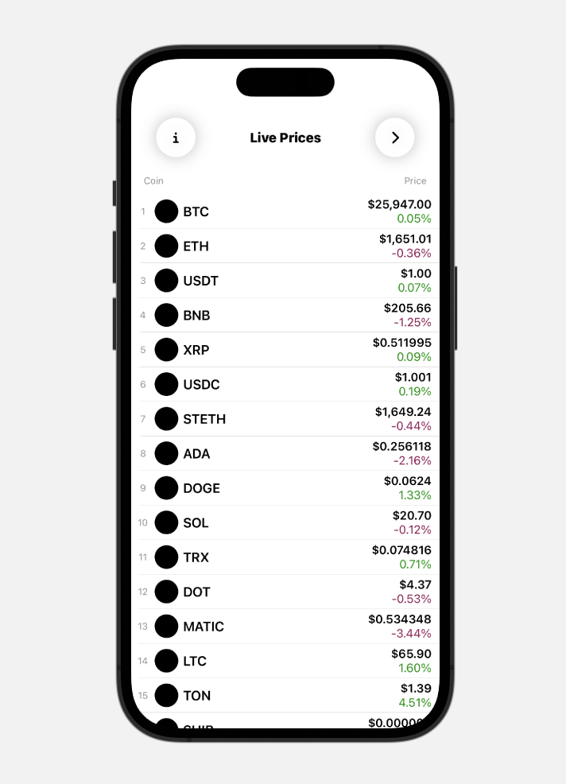

    
    
     
    
    
     
    

<h1 align="center"><b>CryptoX (iOS Application)</b></h1>
<h4 align="center">CURRENTLY IN DEVELOPMENT.</h4>

    

## Table of Contents

- [Introduction](#introduction)
- [Key Functionalities](#key-functionalities)
- [Dependencies](#dependencies)
- [Contributing](#contributing)
- [License](#license)

## Introduction

CryptoX is a cutting-edge cryptocurrency tracker platform that provides users with a seamless and intuitive interface for tracking a wide range of digital assets. Our goal is to empower both novice and experienced traders with the tools they need to make informed decisions and execute trades with confidence.

## Key Functionalities

CryptoX offers the following functionalities:

**Portfolio Management:**

- Enable users to add, edit, and remove cryptocurrencies from their portfolio.
- Display real-time value of their holdings based on current cryptocurrency prices.

**Transaction Tracking:**

- Allow users to record buy, sell, and transfer transactions for accurate portfolio performance tracking.
- Calculate and display gains and losses for each transaction.

**Real-time Data Updates:**

- Integrate with cryptocurrency APIs for real-time price updates.
- Reflect changes in cryptocurrency prices instantly across the portfolio.

**Market Analysis:**

- Provide detailed information for each cryptocurrency, including price charts and historical data.
- Allow users to perform basic technical analysis using charts and indicators.

**Alerts and Notifications:**

- Enable users to set price alerts for specific cryptocurrencies.
- Notify users when cryptocurrency prices meet their specified thresholds.

**User-Friendly Interface:**

- Design an intuitive and responsive UI for easy navigation on various devices.
- Ensure a seamless user experience when managing their portfolio and transactions.

## License

MIT License

Copyright (c) 2023 Jon Rosenblum

Permission is hereby granted, free of charge, to any person obtaining a copy
of this software and associated documentation files (the "Software"), to deal
in the Software without restriction, including without limitation the rights
to use, copy, modify, merge, publish, distribute, sublicense, and/or sell
copies of the Software, and to permit persons to whom the Software is
furnished to do so, subject to the following conditions:

The above copyright notice and this permission notice shall be included in all
copies or substantial portions of the Software.

THE SOFTWARE IS PROVIDED "AS IS", WITHOUT WARRANTY OF ANY KIND, EXPRESS OR
IMPLIED, INCLUDING BUT NOT LIMITED TO THE WARRANTIES OF MERCHANTABILITY,
FITNESS FOR A PARTICULAR PURPOSE AND NONINFRINGEMENT. IN NO EVENT SHALL THE
AUTHORS OR COPYRIGHT HOLDERS BE LIABLE FOR ANY CLAIM, DAMAGES OR OTHER
LIABILITY, WHETHER IN AN ACTION OF CONTRACT, TORT OR OTHERWISE, ARISING FROM,
OUT OF OR IN CONNECTION WITH THE SOFTWARE OR THE USE OR OTHER DEALINGS IN THE
SOFTWARE.
